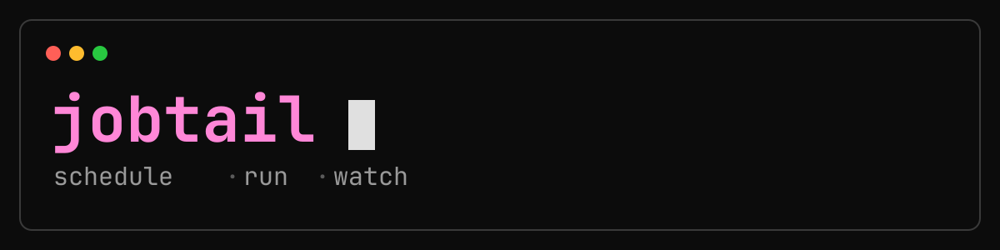
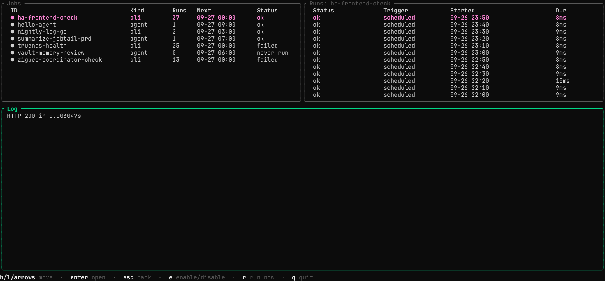
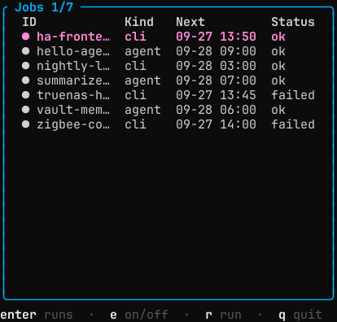

<p align="center">
  
</p>

<p align="center">
  Cron for coding agents — and for everything else you'd have written a cron line for.<br>
  Schedule shell commands <em>and</em> headless AI agent runs, then read every run in a terminal dashboard.
</p>

<p align="center">
  <a href="https://github.com/dalogax/jobtail/releases/latest"></a>
  <a href="LICENSE"></a>
  
</p>

<p align="center"></p>

<p align="center"><sub>Add two jobs → run one now → fold through the agent's transcript → pick the session back up. <a href="scripts/demo/demo.tape">How this was recorded.</a></sub></p>

## Install

```sh
curl -fsSL https://raw.githubusercontent.com/dalogax/jobtail/main/install.sh | sh
jobtail install-scheduler --enable
```

One static binary for Linux and macOS (amd64/arm64) into `~/.local/bin`; no Go toolchain, no package manager. The second line wires up the per-user timer — `systemd --user` or a LaunchAgent — that runs `jobtail tick` once a minute. There's no jobtail daemon to keep alive, and nothing tied to a particular terminal or multiplexer.

Everything lives in one SQLite file. `jobtail upgrade` pulls newer releases later.

## Two kinds of job

```sh
# a shell command
jobtail add backups --kind cli --cron "*/15 * * * *" \
  --cwd ~/scripts --cmd ./check_backups.sh

# a headless agent turn
jobtail add deps-review --kind agent --cron "0 3 * * *" \
  --cwd ~/code/shop --timeout-seconds 1800 \
  --prompt "Check for outdated deps. Open a PR if it's safe to update."
```

An `agent` job runs one non-interactive turn of [Claude Code](https://claude.com/claude-code), [opencode](https://opencode.ai) or [Codex](https://github.com/openai/codex) — pick with `--provider`, default `claude`. It needs no special environment: a prompt and a working directory, the way a `cli` job needs a command and a working directory.

Then `jobtail` opens the dashboard.

## Runs that don't finish

Every run has a timeout: 30 minutes unless the job sets `--timeout-seconds`. Past it, jobtail kills the run's whole process group — the command *and* anything it spawned — and records it as `timeout`.

A job doesn't overlap itself by default (`--max-concurrent 1`): if its previous run is still going when it's due again, the new one is recorded as `skipped_overlap`. So a run that can't end on its own must not be allowed to look like it's still going. If the process executing a run dies outright — killed, crashed, lost to a reboot — the next tick (or the next `jobtail run`) notices, kills whatever it left behind, and marks the run `failed` (or `timeout`, if it was also past its limit). A dead run never blocks its job for more than a minute.

## Reading a run

<p align="center"></p>

Agent transcripts are parsed into blocks, not dumped as JSON: assistant text, each tool call paired with its output, thinking, and a footer with the run's turns, duration and cost. Long tool output is folded behind a line count so a run reads at a glance.

| key | |
| --- | --- |
| `j` `k` | step between tool calls and thinking blocks |
| `enter` | fold or unfold the one under the cursor |
| `o` | unfold everything |
| `↑` `↓` | scroll |
| `r` | resume this run's session |

It live-tails while a run is in progress, and failed runs are red, so "is anything broken?" is answered without opening anything.

### Pick a session back up

Every agent run's session id is captured the moment it starts, even if the run later fails. Press **`r`** on it — or `jobtail resume <run-id>` — and the CLI that produced it reopens *that exact conversation*, rooted at the job's working directory: `claude --resume`, `opencode --session`, or `codex resume`.

So an unattended run that got stuck at 3am isn't something you restart from scratch. You read what it did, then continue it by hand from where it stopped.

<details>
<summary>Where those sessions live</summary>

Resuming means the agent CLI keeps its own session transcript on disk (for claude, under `~/.claude/projects/`), so scheduled runs accumulate there and show up in that tool's own session picker. `jobtail gc` prunes jobtail's runs and logs, not another tool's session store.

</details>

## Your agent drives it; you read the dashboard

The `jobtail` CLI isn't really meant for you to type. Ask your coding agent in plain words:

> every night at 3, check ~/code/shop for outdated dependencies and open a PR if it's safe to bump them

and it writes the `jobtail add` — right cron, working directory, prompt, timeout — test-runs it once, and tells you it's scheduled. Later, "why did the backup check fail last night?" has it read the run's log for you.

What makes that work is the **jobtail skill** ([`skills/jobtail/SKILL.md`](skills/jobtail/SKILL.md)), which teaches an agent how to install jobtail and verify its timer is running, how to write prompts that work unattended, how to gate expensive runs behind a cheap precheck, how to read runs as JSON, and what not to do — like hand-writing crontabs or `rm`-ing a job's history.

```sh
jobtail install-skill                   # every agent found: claude, opencode, codex
jobtail install-skill --agent claude    # or just the ones you name
```

The installer offers this for every supported agent it finds. The skill is embedded in the binary, so the installed copy always matches the jobtail it came from, and `jobtail upgrade` refreshes it.

## Only run the agent when there's something to do

An agent turn costs real time and real tokens, so a job can carry a `--precheck`: a shell command that decides whether the job runs at all.

```sh
jobtail add triage-backlog --kind agent --cron "0 * * * *" \
  --cwd ~/code/shop \
  --precheck './list-open-tickets.sh' --precheck-timeout-seconds 30 \
  --prompt "Triage each ticket below: reproduce it, and either fix it or explain why not."
```

Exit `0` and the job runs, with the precheck's output appended to the prompt as `PENDING ITEMS`. Exit `1` and the run is marked **skipped** — the agent never starts. Anything else marks it **failed**. The cheap deterministic half stays an ordinary shell command you can test on its own; the expensive half only runs when the answer is yes, on exactly what the gate found.

The precheck's output is always written to the run's log, so a skipped run still shows what it saw.

<details>
<summary><b>It fits the terminal you actually have</b></summary>

<br>

| Terminal | Layout |
| --- | --- |
| ≥ 100 cols | jobs and runs side by side, log full width below |
| 56–99 cols | all three panes full width, stacked |
| < 56 cols, or short | one pane at a time — the drill-down it already was |

<p align="center"></p>

Columns drop whole rather than collapsing into ellipses, worst-first, so what's left stays readable — job names and statuses survive longest; run counts and cron expressions go first. Spare width goes the other way: a wide terminal gains a `Cron` column on jobs and an `Exit` column on runs. Panes are sized to their contents, so a long job list gets the rows it needs instead of a fixed fraction of the screen.

On a phone-sized terminal — SSH from a handset, a narrow split — you get one pane, full width, and move through jobs → runs → log with `enter` and `esc` exactly as before.

</details>

<details>
<summary><b>Permission modes for unattended runs</b></summary>

<br>

Unattended `claude` and `codex` runs default to `acceptEdits` and `workspace-write` respectively: file edits are auto-accepted, but never `bypassPermissions`/`danger-full-access` unless a job opts in with `--permission-mode` (its meaning is provider-specific — see `jobtail add --help`).

Avoid `--permission-mode plan` for scheduled `claude` jobs: it expects an interactive approval that headless mode can never provide, and the run just hangs.

</details>

<details>
<summary><b>On macOS, two details worth knowing</b></summary>

<br>

A LaunchAgent starts with almost no environment: its `PATH` is `/usr/bin:/bin:/usr/sbin:/sbin`, which has neither Homebrew nor `~/.local/bin` on it — so `claude`, `opencode`, `codex` and most of what a `cli` job shells out to would not resolve. `install-scheduler` therefore records your current `PATH` (plus the usual Homebrew locations) in the agent. **Re-run it after installing a tool somewhere new**, and after moving the `jobtail` binary. Same for `JOBTAIL_DATA_DIR`, if you set one.

Scheduled jobs run without a UI, so anything touching Desktop, Documents or Downloads can hit a privacy prompt nothing is there to answer, and the job just fails. If that happens, grant Full Disk Access to the `jobtail` binary in System Settings → Privacy & Security.

To check on it: `launchctl print gui/$(id -u)/com.github.dalogax.jobtail.tick`. The timer's output goes to `~/.local/share/jobtail/scheduler.log`.

</details>

<details>
<summary><b>Herdr integration (optional)</b></summary>

<br>

[Herdr](https://herdr.dev) is a terminal workspace manager built around AI coding agent panes. jobtail isn't a Herdr plugin and doesn't need one — it's just a command that runs in any tab or pane. If you do use Herdr, two things light up on their own:

- A failed run fires a `herdr notification` — a desktop toast even when you're not looking at the dashboard.
- Resuming a run opens the session in a new Herdr tab, instead of printing instructions.

Neither needs setup: jobtail looks for `herdr` on `PATH` at the moment it'd be useful and skips both silently if it isn't there.

</details>

<details>
<summary><b>CLI reference</b></summary>

<br>

```
jobtail                      Open the dashboard (same as `jobtail tui`)
jobtail add <id>             Register a new scheduled job
jobtail list                 List all jobs
jobtail show <id>            Show one job's detail and recent runs
jobtail runs <id>            List run history for one job
jobtail log <run-id>         Dump one run's log to stdout
jobtail run <id>             Trigger a job now and wait for it to finish
jobtail resume <run-id>      Reopen an agent run's session (also `r` in the dashboard)
jobtail enable/disable <id>  Pause or resume a job without deleting it
jobtail edit <id>            Change one or more fields of an existing job
jobtail rm <id>              Delete a job and its run history
jobtail gc                   Prune old runs and logs past retention
jobtail install-scheduler    Install the per-user timer that runs due jobs
jobtail install-skill        Install the jobtail skill for your coding agents
jobtail upgrade              Check for and install a newer release
```

`list`, `show` and `runs` take `--json`. `jobtail <command> --help` for the full flag list.

</details>

## How it works, and why

Single Go binary, no config file, SQLite in WAL mode, a per-user OS timer instead of a bundled scheduler daemon, and a Bubble Tea TUI that's a plain terminal program rather than anything needing a specific host. Every decision — and the alternatives rejected — is written up in [`PRD.md`](PRD.md).

## License

MIT — see [`LICENSE`](LICENSE).
